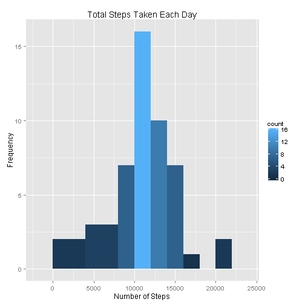
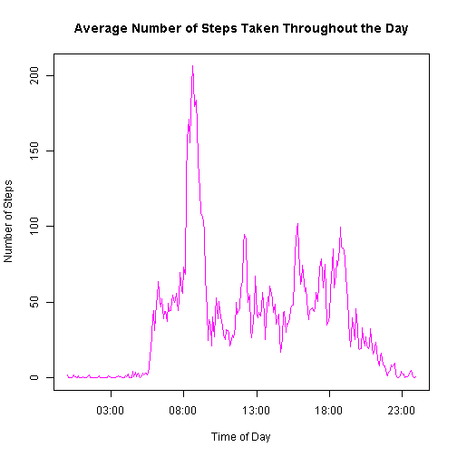
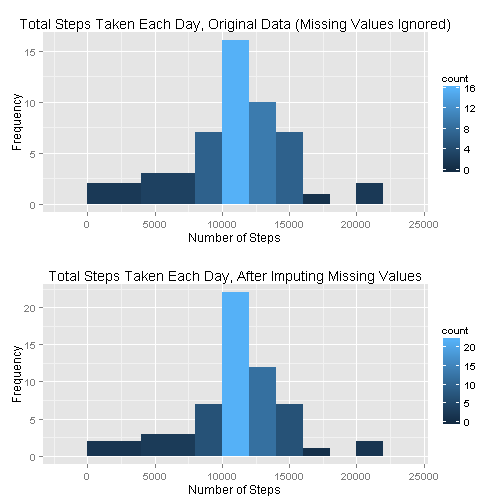
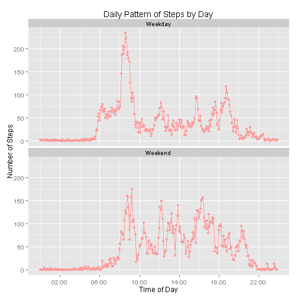

<b><font size="5" color="blue">Reproducible Research, Peer Assessment 1:<br>
*RMarkdown for Literate Statistical Programming* </font><br>
<font size="4" color="blue"> https://github.com/emilyilluminati  </font></b>


### Introduction

This assignment makes use of data from a personal activity monitoring device. This device collects data at 5 minute intervals throughout the day. The data consists of two months of data from an anonymous individual collected during the months of October and November, 2012 shows and measures the total number of steps taken in each 5 minute interval throughout each day.

### Loading and preprocessing the data

First, access and load the data.

```r
# data url
url <- "https://d396qusza40orc.cloudfront.net/repdata%2Fdata%2Factivity.zip"

# download zip file; date last successfully accessed 2015-10-18
if(!file.exists("repdata-data-activity.zip"))
{
  download.file(url,"repdata-data-activity.zip",method="curl")
}

# unzip
unzip("repdata-data-activity.zip")

# read csv file
data <- read.csv("activity.csv")
head(data,10)
```

```
##    steps       date interval
## 1     NA 2012-10-01        0
## 2     NA 2012-10-01        5
## 3     NA 2012-10-01       10
## 4     NA 2012-10-01       15
## 5     NA 2012-10-01       20
## 6     NA 2012-10-01       25
## 7     NA 2012-10-01       30
## 8     NA 2012-10-01       35
## 9     NA 2012-10-01       40
## 10    NA 2012-10-01       45
```

The first step in preprocessing the data is to convert the time intervals  to the character class in the proper %H%M format, where the hours are expressed in military time as 00-23.  Later, combining the time and date, they can be read into the date-time class, POSIXt. Leading zeros are added so that the interval times can be converted later to the date-time class.

```r
# format into character variable in %H%M format
head(data$interval,40)
```

```
##  [1]   0   5  10  15  20  25  30  35  40  45  50  55 100 105 110 115 120
## [18] 125 130 135 140 145 150 155 200 205 210 215 220 225 230 235 240 245
## [35] 250 255 300 305 310 315
```

```r
data$interval <- sprintf("%04d", data$interval)
head(data$interval,40)
```

```
##  [1] "0000" "0005" "0010" "0015" "0020" "0025" "0030" "0035" "0040" "0045"
## [11] "0050" "0055" "0100" "0105" "0110" "0115" "0120" "0125" "0130" "0135"
## [21] "0140" "0145" "0150" "0155" "0200" "0205" "0210" "0215" "0220" "0225"
## [31] "0230" "0235" "0240" "0245" "0250" "0255" "0300" "0305" "0310" "0315"
```


### How many total steps does the individual take each day?
#### Processing the data from 5 minute increments to daily increments

In order to create a histogram comparing the total steps taken each day, first, a daily total must be calculated by summing over all time intervals for each date.

However, in the initial exploratory analysis, it was discovered that some dates have all NA values.


```r
#Count the number of NA values per date
tapply(data$steps, list(data$date), function(x) sum(as.numeric(is.na(x)))) 
```

```
## 2012-10-01 2012-10-02 2012-10-03 2012-10-04 2012-10-05 2012-10-06 
##        288          0          0          0          0          0 
## 2012-10-07 2012-10-08 2012-10-09 2012-10-10 2012-10-11 2012-10-12 
##          0        288          0          0          0          0 
## 2012-10-13 2012-10-14 2012-10-15 2012-10-16 2012-10-17 2012-10-18 
##          0          0          0          0          0          0 
## 2012-10-19 2012-10-20 2012-10-21 2012-10-22 2012-10-23 2012-10-24 
##          0          0          0          0          0          0 
## 2012-10-25 2012-10-26 2012-10-27 2012-10-28 2012-10-29 2012-10-30 
##          0          0          0          0          0          0 
## 2012-10-31 2012-11-01 2012-11-02 2012-11-03 2012-11-04 2012-11-05 
##          0        288          0          0        288          0 
## 2012-11-06 2012-11-07 2012-11-08 2012-11-09 2012-11-10 2012-11-11 
##          0          0          0        288        288          0 
## 2012-11-12 2012-11-13 2012-11-14 2012-11-15 2012-11-16 2012-11-17 
##          0          0        288          0          0          0 
## 2012-11-18 2012-11-19 2012-11-20 2012-11-21 2012-11-22 2012-11-23 
##          0          0          0          0          0          0 
## 2012-11-24 2012-11-25 2012-11-26 2012-11-27 2012-11-28 2012-11-29 
##          0          0          0          0          0          0 
## 2012-11-30 
##        288
```

Thus, in summing the steps over each day, a generic function was used so that dates with missing values would be marked as missing rather than as 0, which would have generated an important downward bias in the average number of steps taken per day.

```r
# create a new data frame with daily total,
# where days with NA values show NA
daily_data <- aggregate(data$steps, list(data$date), 
                        function(x) 
                          if(max(x, na.rm=TRUE)==-Inf) {NA}
                          else {sum(x, na.rm=TRUE)})
names(daily_data) <- c("date","steps")
# format date as %Y-%m-%d
daily_data$date <- strptime(as.character(daily_data$date), "%Y-%m-%d")
head(daily_data)
```

```
##         date steps
## 1 2012-10-01    NA
## 2 2012-10-02   126
## 3 2012-10-03 11352
## 4 2012-10-04 12116
## 5 2012-10-05 13294
## 6 2012-10-06 15420
```

### Make a histogram of the total number of steps taken each day


```r
# Download required packages
if(!("ggplot2" %in% installed.packages())) install.packages("ggplot2")
require("ggplot2")
```

```r
# Make a histogram of the total number of steps taken each day
ggplot(daily_data, aes(x=steps)) + 
  geom_histogram(aes(fill = ..count..),binwidth=2000) + 
  ggtitle("Total Steps Taken Each Day") + 
  labs(x="Number of Steps",y="Frequency")
```

<div class="rimage default"></div>

### Calculate and report the **mean** and **median** total number of steps taken per day

```r
mean(daily_data$steps,na.rm=TRUE)
```

```
## [1] 10766
```

```r
median(daily_data$steps,na.rm=TRUE)
```

```
## [1] 10765
```

The mean number of steps taken each day by the individual from October-November 2012 is **10766.189**, and the median number of steps is **10765**.

<br /><br />
### What is the average daily activity pattern?

Here, the pattern of physical activity throughout the day is explored by examining the trend throughout the day from midnight to midnight in the movement of the person. This will reveal trends of waking and sleeping as well as periods throughout the day in which the individual tends to be most active.  

Similar to the way the data was summed over each day, the same aggregate function is used to find the average number of steps taken in each time interval.

#### Processing the data from the complete dataset of two months of 5 minute intervals to 1 representative (average) day of 5 minute time intervals


```r
# create a new data frame with the interval average,
interval_data <- aggregate(data$steps, list(data$interval), 
                        function(x) mean(x, na.rm=TRUE))

names(interval_data) <- c("interval","steps")
nrow(interval_data)
```

```
## [1] 288
```

```r
head(interval_data)
```

```
##   interval  steps
## 1     0000 1.7170
## 2     0005 0.3396
## 3     0010 0.1321
## 4     0015 0.1509
## 5     0020 0.0755
## 6     0025 2.0943
```

In order to plot a time series of the average steps taken over each five minute period throughout the day, those time intervals must be first converted to the date-time class. 


```r
class(data$interval)
```

```
## [1] "character"
```

```r
head(data$interval,40)
```

```
##  [1] "0000" "0005" "0010" "0015" "0020" "0025" "0030" "0035" "0040" "0045"
## [11] "0050" "0055" "0100" "0105" "0110" "0115" "0120" "0125" "0130" "0135"
## [21] "0140" "0145" "0150" "0155" "0200" "0205" "0210" "0215" "0220" "0225"
## [31] "0230" "0235" "0240" "0245" "0250" "0255" "0300" "0305" "0310" "0315"
```
The time interval variable are read from the character class in format %H%M, where the hours are expressed in military time as 00-23 to the date-time class.

```r
# read data into date-time class
interval_data$interval <- strptime(interval_data$interval, "%H%M")
class(interval_data$interval)
```

```
## [1] "POSIXlt" "POSIXt"
```


### Make a time series plot (i.e. `type = "l"`) of the 5-minute interval (x-axis) and the average number of steps taken, averaged across all days (y-axis)

```r
plot(interval_data$interval,interval_data$steps,type = 'l',col=6,
     main="Average Number of Steps Taken Throughout the Day",
     xlab = "Time of Day",ylab = "Number of Steps")
```

<div class="rimage default"></div>

### Which 5-minute interval, on average across all the days in the dataset, contains the maximum number of steps?


```r
# find location of maximum average steps
i <- which(interval_data$steps %in% max(interval_data$steps))

# display formatted time interval in which it occurs
format(interval_data$interval[i],"%H:%M")
```

```
## [1] "08:35"
```


The 5-minute interval that, on average, contains the maximum number of steps is: **08:35**, in which the individual walked an average of **206.17** steps.


<br /><br />
### Imputing missing values

#### Calculate and report the total number of missing values in the dataset (i.e. the total number of rows with `NA`s)


```r
# total the number of missing values, or NAs, in the original dataset
missings <- sum(as.numeric(is.na(data$steps)))
missings
```

```
## [1] 2304
```

```r
# check the percent of missing values, or NAs
perc <- missings/nrow(data)
sprintf("%1.2f%%", 100*perc)
```

```
## [1] "13.11%"
```

The total number of missing values in the dataset is: **2304**, or **13.11%** of the dataset.


```r
# format date as %Y-%m-%d
data$date <- strptime(as.character(data$date), "%Y-%m-%d")

# How many intervals are missing per day of the week?
tapply(data$steps,weekdays(data$date),
       function(x)
         sum(as.numeric(is.na(x))))
```

```
##    Friday    Monday  Saturday    Sunday  Thursday   Tuesday Wednesday 
##       576       576       288       288       288         0       288
```

```r
# Is any one day missing more than others?
tapply(daily_data$steps,weekdays(daily_data$date),
       function(x)
         sum(as.numeric(is.na(x))))
```

```
##    Friday    Monday  Saturday    Sunday  Thursday   Tuesday Wednesday 
##         2         2         1         1         1         0         1
```

#### Devise a strategy for filling in all of the missing values in the dataset. The strategy does not need to be sophisticated. For example, you could use the mean/median for that day, or the mean for that 5-minute interval, etc.

In choosing a strategy to impute missing values to attenuate a possible missing variable bias, an investigator must be careful not to choose a strategy that could introduce other types of biases.

As seen in the time series graph in the following section, comparing the activity pattern over the weekend and weekday, there is clearly a distinct pattern of steps on the weekend versus the weekday.  This distinct pattern was discovered in the exploratory analysis.  For example, on weekdays, the individual wakes up early to go to work as indicated by many steps earlier in the day followed by a pattern of fairly sedentary office work, with spurts of steps throughout the day. On weekend days, the individual awakens later and then has a fairly steady pattern of steps throughout the morning and afternoon. 

Taking this into account, the strategy for imputing missing values involves calculating the average number of steps for each 5 minute time interval for a weekday or weekend and then substituting one of these averages into each corresponding time interval containing `NA`, depending whether the day is a weekday or weekend.  

In other words, for the time interval 8:30, there will be one average for a weekday and another for a weekend. Any corresponding time interval 8:30 which contains an `NA` value will be substituted with the appropriate 8:30 average number of steps, depending on whether the day with the `NA` value is a weekend or weekday.

#### Create a new dataset that is equal to the original dataset but with the missing data filled in.


```r
# format date as %Y-%m-%d
data$date <- strptime(as.character(data$date), "%Y-%m-%d")

# create a factor variable indicating the day of the week
data$weekday <- weekdays(data$date)
head(data)
```

```
##   steps       date interval weekday
## 1    NA 2012-10-01     0000  Monday
## 2    NA 2012-10-01     0005  Monday
## 3    NA 2012-10-01     0010  Monday
## 4    NA 2012-10-01     0015  Monday
## 5    NA 2012-10-01     0020  Monday
## 6    NA 2012-10-01     0025  Monday
```

```r
# create a new factor variable, 
#   indicating whether it is the weekend or a workday
weekend <- vector("character",length(data$weekday))
weekend[ data$weekday %in% c("Sunday","Saturday")] <- "Weekend"
weekend[ !data$weekday %in% c("Sunday","Saturday")] <- "Weekday"
data$weekend <- weekend
head(data)
```

```
##   steps       date interval weekday weekend
## 1    NA 2012-10-01     0000  Monday Weekday
## 2    NA 2012-10-01     0005  Monday Weekday
## 3    NA 2012-10-01     0010  Monday Weekday
## 4    NA 2012-10-01     0015  Monday Weekday
## 5    NA 2012-10-01     0020  Monday Weekday
## 6    NA 2012-10-01     0025  Monday Weekday
```

Now, that a new indicator variable was created indicating whether the day is a weekday or weekend.  A new dataset is created that will specify the average number of steps taken for each time interval on weekend days and weekdays.  This dataset of average will be merged with the original to replace the corresponding `NA` values.


```r
# calculate the average activity per time interval by whether
#    it is the weekend or a workday
# read interval into date-time class
data_weekend <- aggregate(steps~interval+weekend, data=data,
                          mean, na.rm=TRUE)
data_weekend$weekend <- factor(data_weekend$weekend, 
                               levels= c("Weekday", "Weekend"))
```


```r
# Merge original data frame with data_weekend containing average steps
#  by day of the week and time interval

# first change steps to Average Steps
colnames(data_weekend)
```

```
## [1] "interval" "weekend"  "steps"
```

```r
colnames(data_weekend)[3]<-"Average_Steps"
colnames(data_weekend)
```

```
## [1] "interval"      "weekend"       "Average_Steps"
```
<br />
Check that both of the interval columns are formatted in the same way and then merge the two dataframes by the weekend and interval variables.


```r
head(data_weekend)
```

```
##   interval weekend Average_Steps
## 1     0000 Weekday         2.333
## 2     0005 Weekday         0.462
## 3     0010 Weekday         0.179
## 4     0015 Weekday         0.205
## 5     0020 Weekday         0.103
## 6     0025 Weekday         1.513
```

```r
head(data)
```

```
##   steps       date interval weekday weekend
## 1    NA 2012-10-01     0000  Monday Weekday
## 2    NA 2012-10-01     0005  Monday Weekday
## 3    NA 2012-10-01     0010  Monday Weekday
## 4    NA 2012-10-01     0015  Monday Weekday
## 5    NA 2012-10-01     0020  Monday Weekday
## 6    NA 2012-10-01     0025  Monday Weekday
```

```r
data2<-data
data2<-merge(data2, data_weekend, by = c("interval","weekend"))
head(data2,20)
```

```
##    interval weekend steps       date   weekday Average_Steps
## 1      0000 Weekday    NA 2012-10-01    Monday          2.33
## 2      0000 Weekday     0 2012-11-23    Friday          2.33
## 3      0000 Weekday    34 2012-10-10 Wednesday          2.33
## 4      0000 Weekday     0 2012-11-06   Tuesday          2.33
## 5      0000 Weekday     0 2012-10-31 Wednesday          2.33
## 6      0000 Weekday     0 2012-11-15  Thursday          2.33
## 7      0000 Weekday     0 2012-10-02   Tuesday          2.33
## 8      0000 Weekday     0 2012-11-16    Friday          2.33
## 9      0000 Weekday     0 2012-11-07 Wednesday          2.33
## 10     0000 Weekday     0 2012-10-11  Thursday          2.33
## 11     0000 Weekday     0 2012-11-13   Tuesday          2.33
## 12     0000 Weekday     0 2012-11-08  Thursday          2.33
## 13     0000 Weekday     0 2012-10-12    Friday          2.33
## 14     0000 Weekday     0 2012-10-30   Tuesday          2.33
## 15     0000 Weekday     0 2012-11-26    Monday          2.33
## 16     0000 Weekday    47 2012-10-04  Thursday          2.33
## 17     0000 Weekday     0 2012-11-27   Tuesday          2.33
## 18     0000 Weekday     0 2012-11-12    Monday          2.33
## 19     0000 Weekday    NA 2012-11-30    Friday          2.33
## 20     0000 Weekday     0 2012-10-05    Friday          2.33
```

<br />
Now, re-fill in the variable steps with Average Steps only when steps==NA.

```r
data2$steps[is.na(data2$steps)]<- (
                      data2$Average_Steps[is.na(data2$steps)])
head(data2,20)
```

```
##    interval weekend steps       date   weekday Average_Steps
## 1      0000 Weekday  2.33 2012-10-01    Monday          2.33
## 2      0000 Weekday  0.00 2012-11-23    Friday          2.33
## 3      0000 Weekday 34.00 2012-10-10 Wednesday          2.33
## 4      0000 Weekday  0.00 2012-11-06   Tuesday          2.33
## 5      0000 Weekday  0.00 2012-10-31 Wednesday          2.33
## 6      0000 Weekday  0.00 2012-11-15  Thursday          2.33
## 7      0000 Weekday  0.00 2012-10-02   Tuesday          2.33
## 8      0000 Weekday  0.00 2012-11-16    Friday          2.33
## 9      0000 Weekday  0.00 2012-11-07 Wednesday          2.33
## 10     0000 Weekday  0.00 2012-10-11  Thursday          2.33
## 11     0000 Weekday  0.00 2012-11-13   Tuesday          2.33
## 12     0000 Weekday  0.00 2012-11-08  Thursday          2.33
## 13     0000 Weekday  0.00 2012-10-12    Friday          2.33
## 14     0000 Weekday  0.00 2012-10-30   Tuesday          2.33
## 15     0000 Weekday  0.00 2012-11-26    Monday          2.33
## 16     0000 Weekday 47.00 2012-10-04  Thursday          2.33
## 17     0000 Weekday  0.00 2012-11-27   Tuesday          2.33
## 18     0000 Weekday  0.00 2012-11-12    Monday          2.33
## 19     0000 Weekday  2.33 2012-11-30    Friday          2.33
## 20     0000 Weekday  0.00 2012-10-05    Friday          2.33
```
<br />
### Total number of steps taken each day, after imputing missing values
#### Make a histogram of the total number of steps taken each day.  Calculate and report the **mean** and **median** total number of steps taken per day. Do these values differ from the estimates from the first part of the assignment? What is the impact of imputing missing data on the estimates of the total daily number of steps?

First, the new, filled-in dataset must be processed again from 5 minute increments to daily increments by summing all the steps taken on each date.

```r
# create a new data frame with daily total
daily_data2 <- aggregate(data2$steps, list(as.character(data2$date)), 
                        function(x) 
                          if(max(x, na.rm=TRUE)==-Inf) {NA}
                        else {sum(x, na.rm=TRUE)})
names(daily_data2) <- c("date","steps")
```

The original histogram and the histogram of the data with the missing values are plotted and compared.

```r
if(!("grid" %in% installed.packages())) install.packages("grid")
require("grid")
if(!("gridExtra" %in% installed.packages())) install.packages("gridExtra")
require("gridExtra")
```

```r
# Make a histogram of the total number of steps taken each day
original <- ggplot(daily_data, aes(x=steps)) + 
  geom_histogram(aes(fill = ..count..),binwidth=2000) + 
  ggtitle("Total Steps Taken Each Day, Original Data (Missing Values Ignored)") + 
  labs(x="Number of Steps",y="Frequency")

missings_replaced <- ggplot(daily_data2, aes(x=steps)) + 
  geom_histogram(aes(fill = ..count..),binwidth=2000) + 
  ggtitle("Total Steps Taken Each Day, After Imputing Missing Values") + 
  labs(x="Number of Steps",y="Frequency")
grid.arrange(original,missings_replaced)
```

<div class="rimage default"></div>

#### Calculate and report the **mean** and **median** total number of steps taken per day

Here, the mean and median of total number of daily steps are calculated and reported.


```r
# Calculate and report the **mean** and **median** total number of steps taken per day
mean(daily_data2$steps,na.rm=TRUE)
```

```
## [1] 10762
```

```r
median(daily_data2$steps,na.rm=TRUE)
```

```
## [1] 10571
```


The mean number of steps taken each day by the individual from October-November 2012 in the original dataset, simply ignoring NA values, was **10766.189**, and the median number of steps was **10765**.

In contrast, the mean of the dataset with imputed missing values is **10762.052**, and median is **10571**.

After imputing missing values, the histogram shows an increase in frequency, indicating more days in the sample set.  However, the overall histogram shape, along with the mean and median values, are not skewed because we did a careful exploratory analysis before creating the original histogram and did not allow the missing data to bias our original results.  In the original histogram, days with missing values were marked as `NA` and excluded, rather than estimated to have `0` steps, a very unrealistic scenario.

The fact that the overall histogram shape and values of the mean and median do not change drasticaly, shows that the strategy to impute missing values based on time interval and whether the day was a weekend or weekday was likely successful in not introducing additional bias.

<br /><br />
### Are there differences in activity patterns between weekdays and weekends?

#### Create a new factor variable in the dataset with two levels -- "weekday" and "weekend" indicating whether a given date is a weekday or weekend day.

Here, the process of creating a dataset with a a new factor variable, weekend, containing the levels "weekday" and "weekend" is simply repeated from the previous section.

This same process was used to create the average values of weekends and weekdays to impute missing values.


```r
# format date as %Y-%m-%d
data$date <- strptime(as.character(data$date), "%Y-%m-%d")

# create a factor variable indicating the day of the week
data$weekday <- weekdays(data$date)
head(data)
```

```
##   steps       date interval weekday
## 1    NA 2012-10-01     0000  Monday
## 2    NA 2012-10-01     0005  Monday
## 3    NA 2012-10-01     0010  Monday
## 4    NA 2012-10-01     0015  Monday
## 5    NA 2012-10-01     0020  Monday
## 6    NA 2012-10-01     0025  Monday
```

```r
# create a new factor variable, 
#   indicating whether it is the weekend or a workday
weekend <- vector("character",length(data$weekday))
weekend[ data$weekday %in% c("Sunday","Saturday")] <- "Weekend"
weekend[ !data$weekday %in% c("Sunday","Saturday")] <- "Weekday"
data$weekend <- weekend
head(data)
```

```
##   steps       date interval weekday weekend
## 1    NA 2012-10-01     0000  Monday Weekday
## 2    NA 2012-10-01     0005  Monday Weekday
## 3    NA 2012-10-01     0010  Monday Weekday
## 4    NA 2012-10-01     0015  Monday Weekday
## 5    NA 2012-10-01     0020  Monday Weekday
## 6    NA 2012-10-01     0025  Monday Weekday
```


```r
# calculate the average activity per time interval by whether
#    it is the weekend or a workday
# read interval into date-time class
data_weekend <- aggregate(steps~interval+weekend, data=data,
                          mean, na.rm=TRUE)
data_weekend$weekend <- factor(data_weekend$weekend, 
                               levels= c("Weekday", "Weekend"))
```


```r
# read interval into date-time class
data_weekend$interval <- 
  strptime(as.character(data_weekend$interval), format = "%H%M")
```

### Make a panel plot containing a time series plot (i.e. `type = "l"`) of the 5-minute interval (x-axis) and the average number of steps taken, averaged across all weekday days or weekend days (y-axis).


```r
if(!("scales" %in% installed.packages())) install.packages("scales")
require("scales")
```

```r
# Make a time series plot (i.e. `type = "l"`)
ggplot(data = data_weekend, aes(x = interval, 
                                y = steps)) + 
  geom_line(colour="#FF9999") + 
  geom_point(colour="#FF9999") +
  facet_wrap(~weekend, nrow = 2, ncol = 1) +
  scale_x_datetime(labels = date_format("%H:%M"), 
                   breaks = date_breaks("4 hours")) +
  ggtitle("Daily Pattern of Steps by Day") + 
  labs(x="Time of Day",y="Number of Steps",color = "")
```

<div class="rimage default"></div>

In the above panel plot, the differences in the pattern of movement between the weekend and weekday are apparent.  The individual rises later on the weekend and has consistent activity throughout the afternoon.  

In contrast, the pattern of rising earlier and a peak of rushed steps around what is likely the arrival time at work is apparent on the weekdays.  This rush to arrive at work is followed by an activity pattern that indicates a relatively sendentary job along with bursts of movement throughout the day.
